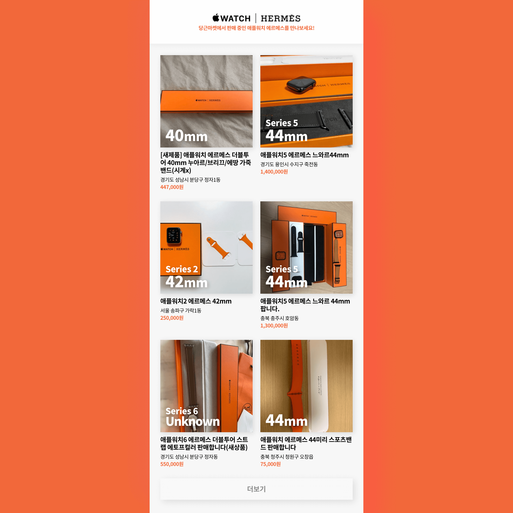

<h1 align="center">
  Hermès Daangn Market
</h1>

  <strong>
    당근마켓에서 판매 중인 애플워치 에르메스를 만나보세요!
  </strong>
   
   
  
  <blockquote>
    🥕당근마켓에서 애플워치 🎠<strong>에르메스</strong> 매물만 찾은 뒤, 
    ⌚️<strong>시리즈 및 크기</strong>를 알기 쉽게 💉<strong>추출</strong>해 보여주는 서비스 
    <i>
      Filter markets for Apple Watch Hermès at <a href="https://www.daangn.com/">Daangn</a>; 
      Extracts and display information such as series & sizes
    </i>
  </blockquote>

  <a href="https://hermes-daangn.vercel.app/">
    <strong>✨ Deployment</strong>
  </a>

## 💡 The Idea

> Buy a second-hand Hermès Apple Watch Series 4 at $700~, 
> sale out the leather band for at least $200, 
> and you can get a Hermès edition with an orange sport band, for $400~$500!
>  - **the same middle price as the regular one!**

지인 분이 위처럼 [중고나라](https://www.joongna.com/)나 [당근마켓](https://www.daangn.com/)에서 4세대 정도 에르메스 애플워치를 싼 가격에 구입한 뒤 가죽 줄만 팔면, 
대부분 ✨<strong>일반 제품의 중고가</strong>✨에 가질 수 있다는 비결(?)을 알려주셨는데 되게 재미있게 들렸답니다.

  
  <blockquote>얘가 귀여워서 당근마켓을 하기로 해땨</blockquote>

그래서 우연히 좋은 분을 만나 실제로 물건도 찾고 거래를 해보게 되었는데, **사람마다 올리는 게시글 형식이 다르기 때문에 내가 구입하고자 하는 모델의 사양(시리즈 숫자와 사이즈 이건 필수!)을** 한눈에 알기 어렵다고 느꼈습니다. 또한 당근마켓 앱의 경우 현재 설정된 동네와 **일정 거리가 있는 동네의 물건은 검색결과에 표시되지 않기 때문에,** 자주 가는 학교나 회사가 있는 동네에서 올라온 매물은 확인이 어려웠습니다(대신 동네는 두 개까지 저장했다가 나중에 인증 가능).

1. <strong>정규식</strong>을 통해 게시글 제목과 본문에서 시리즈 정보(`6`부터 `1`)와 사이즈 정보(`44`, `42`, `40`, `38`mm)를 파싱할 수 있도록 만들었어요.
2. Vercel의 [Serverless Functions](https://vercel.com/docs/serverless-functions/introduction)를 이용하면 지원하는 여러 프레임워크로 빠르게 <strong>서버리스 API</strong>를 만들 수 있어요. 어느 정도는 응답이 캐싱되기 때문에 특히 [Sanic](https://sanic.readthedocs.io/en/latest/)과 [BeautifulSoup](https://www.crummy.com/software/BeautifulSoup/bs4/doc/)으로 모든 동네의 결과를 보여주는 당근마켓 웹 검색 페이지의 결과에서 필요한 정보를 가져오고, 시리즈와 사이즈 정보를 추가해 반환하는 API를 만들었어요.
